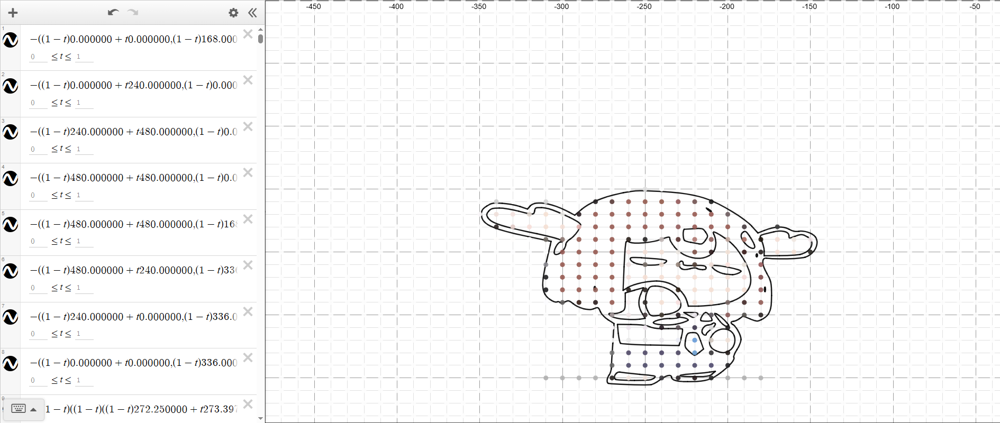

# Desmos Animations

> This project is used to convert images and videos into Bezier curve lattices and display them on Desmos.

## Demo

### Converted Image    
This image was converted into Bezier curve lattices:  


### Generated Animation  
This animation was created by combining multiple frames:  


## Saving Your Graph

If you want to save the generated graph to your Desmos account, follow these steps:

1. **Open the graph** in your browser that was generated by this program.
2. Open the browser console (press `CTRL + SHIFT + J`, or right-click the page and choose **Inspect > Console**).
3. Run the following command:
    ```javascript
    calculator.getState();
    ```
4. A result will appear under the command. Right-click it and choose **Copy object**
5. Go to [Desmos](https://www.desmos.com/calculator) and open the console again.
6. Type this command (but don’t press Enter yet):
    ```javascript
    Calc.setState();
    ```
7. Place your cursor between the parentheses, paste the object you copied (`CTRL + V`), then press `Enter`.

8. Wait for the graph to load. After it's loaded, you’ll see a **Save** button at the top—click it to save to your account (you must be logged in).
